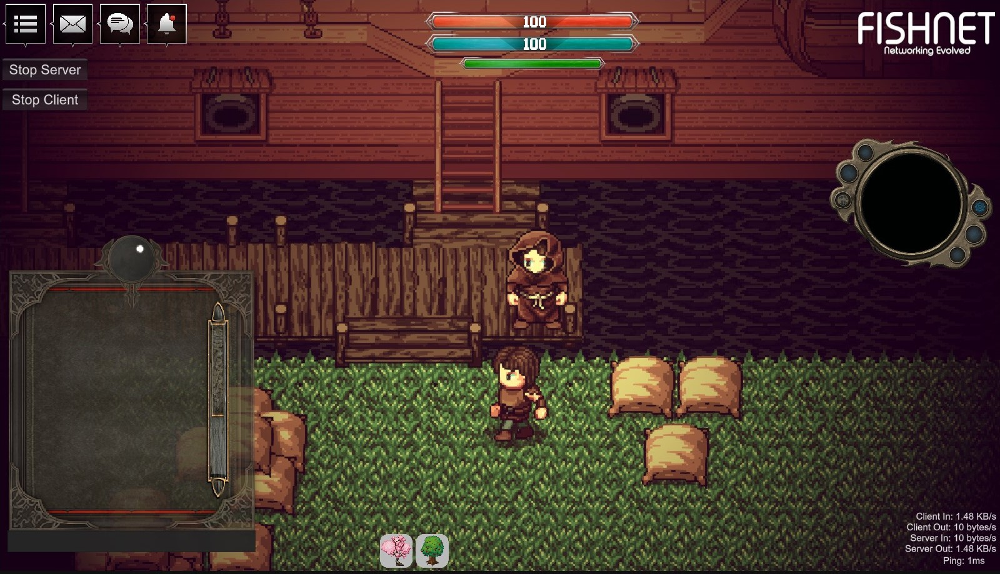

# FishNet-Showcase

LEFT HERE FOR POSTERITY - This code is no longer maintained and should be considered deprecated.

 

A 2D URP FishNet showcase in Unity 6 with addressables created by Shadowfinder Studios. With 2D navmesh agent support using NavMeshPlus. The sample is set up to work with Unity Multiplayer Play Mode for quick testing.

Make sure to load the correct scene (Village1 or City) before running the relative Play Mode.

## Features

[Feature List](Features.md)

## Showcases

Showcase 1 - Scene loading and addressables

1. Walk to the right to trip the loadable area.

2. When the next scene loads, you can press Spacebar to spawn trees.

3. Trees cannot be spawned in the main scene until you walk into the next scene because that's when the addressables load.

4. Press 1 or 2 or click the tree icons at the bottom of the screen to switch between tree types.

Showcase 2 - Rideables

1. Press E near the boat to ride it and E again to dismount.

2. Move around after using the boat to ride it around.

3. The boat cannot pass thru the ground, but can pass through the water due to tilemap colliders.

Showcase 3 - Mineable Rocks

1. Walk up to a rock.

2. Press E near the rock to swing the pickaxe at it.

3. Keep hitting the rock until it turns to rubble.

4. ???

Showcase 4 - Switchable Character

1. Press the C key to switch the character.

2. Character can now be switched using a SpriteLibrary over the network.

Showcase 5 - Proximity radio

1. The music won't play until you're within distance of the northern radio.

2. If you walk outside the range of the radio it will pause.

3. This is network aware and an observer is used to manage visibility as well.

Showcase 6 - Shooting arrows

1. Press Q to ready your bow.

2. Aim in the direction you want to aim.

3. Point your mouse somewhere on the screen and left click and hold.

4. When ready, release the mouse button to shoot the arrow.

5. Press Q again to holster your bow.

Showcase 7 - Campfire damage zone, healing aura zone

1. Walk into the campfire and take damage, watch health go down

2. Walk into the healing aura and heal, watch health go up faster

3. Stand still outside of either zone and watch health regen slowly

4. Stand in campfire damage zone until health hits zero, watch Death

5. Attempt to move around after death, input is locked

Showcase 8 - Swing pickaxe, shoot arrows, or cast summon tree to affect stats

1. Cast summon tree, or shoot an arrow, or swing your pickaxe

2. Watch stamina go down.

3. Wait and watch stamina regen

Showcase 9 - NPC Wanderer

1. Watch the wandering NPC run around aimlessly. (Now via Unity Behavior Graph)

2. ???

Showcase 10 - Chat system (unauthenticated for testing purposes)

1. Jot some text in the chat box.

2. See the other side respond.

3. Random names are seeded with the client id for testing purposes.

Showcase 11 - Behavior Graph for a Dockworker

1. Dockworker gathers a bag if available.

2. And, takes it onto the ship, if there is room in the pile.

3. Then, deposits the bag and repeats.

Showcase 12 - Behavior Graph for car traffic and new scene for City demo

1. Car arrives at stoplight, waits for light to change.

2. Car choose whether to turn or drive ahead.

3. Car moves to the next stoplight, repeat.

Showcase 13 - Rideable horse

1. Walk up to horse

2. Press E to use

3. Ride around

Showcase 14 - NPC Emotions

1. Watch the NPC, see their emotion change over time.

2. TODO: handle alarm, thirst, etc

Showcase 15 - Containers (W.I.P.)

1. Walk up to a chest

2. Press the use key E

3. (Currently, in local chat it'll say what loot was generated.)

4. TODO: Implement UI for inventory system.

5. TODO: Implement spawning dropped items taken from containers.

6. TODO: Implement storing into containers.

7. TODO: Implement retrieving into player inventory from containers.

8. TODO: Implement retrieving/storing to/from NPC inventory from containers.

9. TODO: Implementing buying/selling of items via containers.

Showcase 16 - Inventory (W.I.P.)

1. Press I, inventory will open

2. Drag drop items

3. ?

4. Press I again to close inventory

Showcase ? - TODO: Farming

1. Buy seeds

2. Throw seeds

3. Water ground

4. Wait

5. Grow

6. Harvest

7. Sell crops

TODO: More showcases.

## Known Bugs

1. A reconnecting player doesn't see the animator updates from the dockworker until his state changes again. - Still need to work out how to fix this.

## Art and Sound Credits

Please refer to [Art and Sound Credits](CREDITS.md) for more details.

## License

This code is MIT
